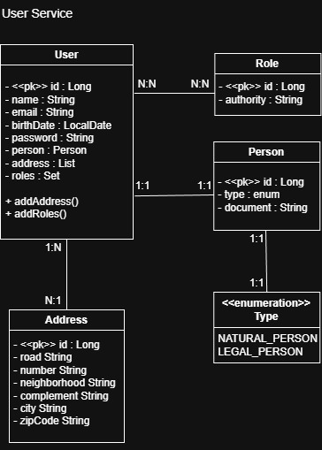

---

# 👤 User Service API

Este microsserviço é responsável pela autenticação e gerenciamento de usuários em uma arquitetura baseada em microsserviços.

Ele lida com o registro de usuários (individual e corporativo), autorização baseada em funções e acesso seguro usando tokens JWT, com o suporte do Spring Authorization Server.

---

## 🧭 Visão Geral da Arquitetura


---

## 📐 Arquitetura e Modelagem
O projeto foi desenvolvido com foco em escalabilidade e manutenção, utilizando padrões de mercado:

* **Arquitetura em Camadas:** Separação entre Controller, Service e Repository, promovendo baixo acoplamento e alta coesão.
* **Modelagem de Dados:** Relacionamentos complexos $N:N$ para Perfis (Roles) e $1:1$ para detalhes de Pessoa e Endereço.
* **Projeções (Spring Data JPA):** Otimização de consultas ao banco de dados, buscando apenas os campos necessários através de interfaces de projeção.
* **Handlers de Exceção:** Tratamento global de erros através de um `@ControllerAdvice`, garantindo respostas HTTP padronizadas e seguras.
* **DTOs (Data Transfer Objects):** Camada de transporte de dados para isolar a lógica de negócio das entidades de persistência.

---

## 🛠️ Tecnologias e Ferramentas
* **Linguagem:** Java
* **Framework:** Spring Boot 3, Spring Data JPA, Spring Security 
* **Segurança:** Servidor de autorização OAuth2 com tokens JWT (Servidor de Autorização Spring)
* **Banco de Dados:** PostgreSQL (Produção/Dev) e H2 (Testes) 
* **APIs:** REST, Swagger/OpenAPI 
* **Testes:** JUnit 5, Mockito 
* **Build:** Maven 

---

## 🧪 Qualidade de Software
A aplicação possui uma sólida cobertura de testes automatizados, garantindo a confiabilidade das regras de negócio:

* **Testes de Integração (IT):** Validação de fluxos completos de ponta a ponta, desde o Controller até a persistência.
* **Testes de Unidade:** Foco em lógica isolada com o uso intensivo de Mocks.
* **Factories de Teste:** Implementação de fábricas de objetos (`UserFactory`) para garantir cenários de teste consistentes e reutilizáveis.

---

## 📂 Documentação e Testes Manuais
Para facilitar a exploração da API, o projeto inclui:
* **Diagramas:** Modelagem de Entidade e Classe detalhada (disponível em `src/main/java/com.rpdevelopment.user_service_api/docs/diagrams`).
* **Postman:** Collection e Environment prontos para importar e testar os endpoints imediatamente. (disponível em `src/main/java/com.rpdevelopment.user_service_api/docs/postman`).
* **Swagger:** Documentação interativa disponível via UI ao rodar a aplicação.

    * Swagger UI (local environment)
      👉 http://localhost:8080/swagger-ui/index.html

    * OpenAPI JSON (local environment)
      👉 http://localhost:8080/v3/api-docs

---

### 🔹 JWT e Autenticação

Todos os endpoints requerem autenticação JWT:

1. Obtenha o token via endpoint `/login`.
2. Clique em **Authorize** no Swagger UI.
3. Cole o token no formato `Bearer <token>`.
4. Execute as requisições nos endpoints protegidos.

---

## 🚀 Endpoints Principais

| Endpoint | Método | Descrição |
|----------|--------|-----------|
| `/users` | GET | Lista todos os usuários |
| `/users` | POST | Cria um novo usuário |
| `/users/{id}` | PUT | Atualiza um usuário |
| `/users/{id}` | DELETE | Remove um usuário |
| `/users/{userId}/roles/{roleId}` | PUT | Adiciona ou atualiza roles de um usuário |
| `/login` | POST | Gera token JWT |

### Exemplo de GET `/users`

```json
[
  {
    "id": 1,
    "name": "João Silva",
    "email": "joao@email.com",
    "roles": ["ROLE_ADMIN"]
  }
]
```
---
## ▶️ Executando o Projeto

### Requisitos
- Java 21+
- Maven
- PostgreSQL

### Passos

```bash
git clone https://github.com/romulomotadev/portfolio-spring-01-user-service-api.git
cd portfolio-spring-01-user-service-api
mvn clean install
mvn spring-boot:run
```
---

## 🚀 Próximos Passos
Este projeto é a primeira etapa de um ecossistema de quatro microsserviços voltados para o portfólio profissional:
1. **User Service:** Gestão de Usuários e Autenticação.
2. **Product & Inventory Service:** Gestão de estoque e catálogo (Em desenvolvimento).
3. **Order Service:** Orquestração de pedidos com integração entre serviços e mensageria (RabbitMQ) - (Em desenvolvimento).
4. **Infraestrutura:** Conteinerização com **Docker**, monitoramento com **Prometheus/Grafana** e deploy via **AWS**. (Em breve)

---

### 👨‍💻 Autor
**Rômulo Mota** - Desenvolvedor Java Backend em transição de carreira.
* [LinkedIn](https://linkedin.com/in/romulomotadev)
* [GitHub](https://github.com/romulomotadev)